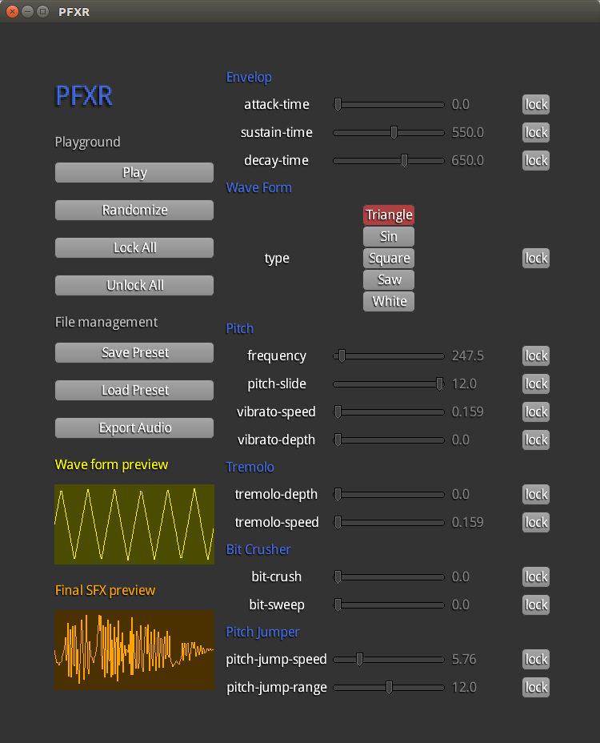
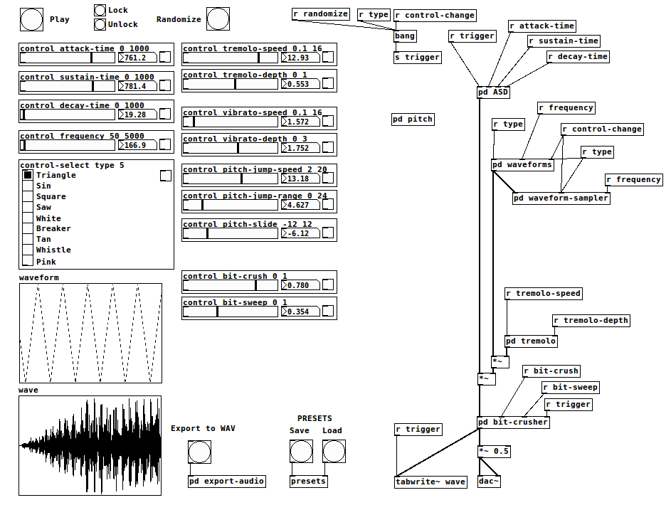

PFXR is a tool to generate sound FX mainly for games.

It's largely inspired by [BFXR](https://www.bfxr.net/)

This repository provides 2 implementations : 

* The core implementation made with [PureData](https://puredata.info/), you can find runnable pd patch in **pd/pfxr.pd** folder.
* A libGDX implementation using the PureData patches, you can download and install it from [Releases section](https://github.com/mgsx-dev/pfxr/releases)

LibGDX implementation use the [GDX PureData extension](https://github.com/mgsx-dev/gdx-pd) in order to run the patch.

Here is the libGDX app :

and the main PD patch :

